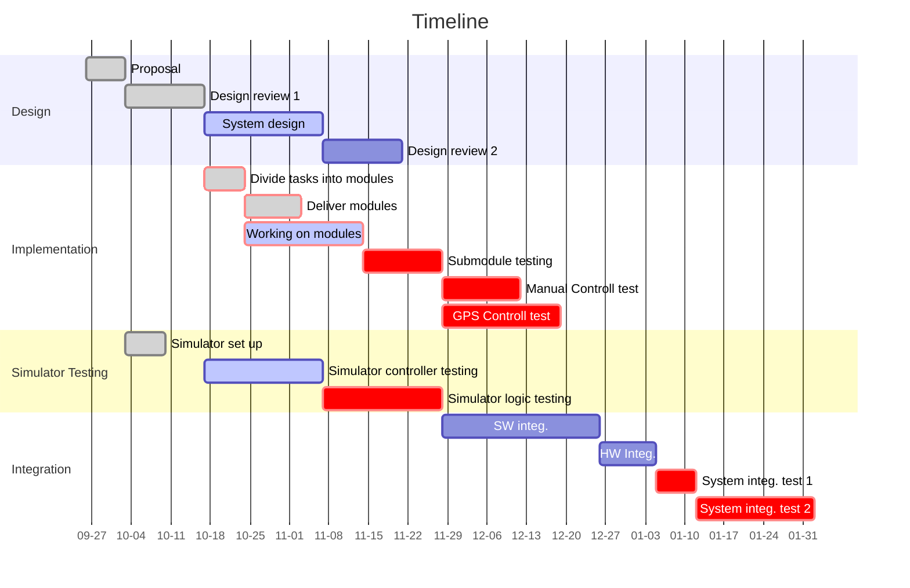

# Airdrop Software


---
[[_TOC_]]
##  1. Introduction

Welcome to UAV Airdrop software! We are the subteam in [UBC UAS](www.ubcuas.com) that is responsible for the Airdrop task section of the [AUVSI compeition](https://www.auvsi-suas.org/). This document will introduce you to our system and how we develop it, hopeful give you some insight on the project, as well as contributing to it as soon as possible.  

clone this project with:
```bash
git clone --recurse-submodules git@gitlab.com:ubcuas/payload/airdrop-software-2020.git
```
> You didn't set up ssh? How dare you: [https://docs.gitlab.com/ee/ssh/](https://docs.gitlab.com/ee/ssh/)

Before you process to work on the project, please see this checklist of documents to read:
  - [ ] [Development Workflow](docs/WORK_FLOW.md)
  - [ ] [System overview](docs/DESIGN.md)
  - [ ] [Code Standard](docs/CODE_STANDARD.md)

Current Timeline:


##  2. Development 

###  2.1 Workflow

We use [Trello](https://trello.com/b/pWR6ylrp) for project managing. The detailed sprint and tasks are on the Trello board, and we will use them to list out detailed description of the task, subtasks, assignee of the task, due date and checklist. Please refer to the Trello board for your tasks frequently for updates. If you don't have access to this board, please ask your subteam lead to add you to it. 

Please refer to [Work flow](docs/WORK_FLOW.md) for how we use git for version control. 

###  2.2 Design

If you are interested in our software and hardware system design, please refer to [design](docs/DESIGN.md)

###  2.3 Code Style Guide

If you are curious about what our coding convention is, what coding style is acceptable or what's the preferred OOP standard, please see [Style Guide](docs/CODE_STANDARD.md).

Our code are automatically formatted with [`.clang-format`](../airdrop-software-2020/.clang-format). If you are using VSCode, you can set up clang format, so that it will use the `.clang-format` to format your code whenever you save: [official document](https://code.visualstudio.com/docs/cpp/cpp-ide#:~:text=Code%20formatting%23,in%20right%2Dclick%20context%20menu.)

##  3 Installation

Supported OS: Window, MacOS, Linux

Software Checklist
- [vscode](https://code.visualstudio.com/download)
- [webots](https://www.cyberbotics.com/)

VSCode plugins
- [platformio](https://platformio.org/platformio-ide)
  - might require `python3` installed
- [live share](https://visualstudio.microsoft.com/services/live-share/)
  - require gitlab/microsoft login
- [clang-format](https://marketplace.visualstudio.com/items?itemName=xaver.clang-format)

Others
- usb driver is updated (on linux, please check `lsusb`)

###  3.1 Build

####  3.1.1 Platformio project

```bash
# build the project
pio run
# or
platformio run

## build and upload
pio run --target upload

## build only certain environment
pio run -e teensy40

## build only teensy and upload it only
pio run -e teensy40 -t upload
```

####  3.1.2 Webots project

- open the project
- compile the code
- run simulation and use keyboard to control.

###  3.2 Run

- upload the `latest` from `origin/master` to Teensy 4.0


###  3.3 Test

####  3.3.1 Software testing

We use `platformio test` for running out unit test. See [platformio document](https://docs.platformio.org/en/latest/plus/unit-testing.html). Current CI does include some of the testing, but it's only there to make sure that the commit will build. Current we don't have remote testing set up. See details at [Testing](rover/Wall-E/test/README.md)

####  3.3.2. HITL(Hardware in the loop)

####  3.3.3 SITL(Software in the loop)

Our software in the loop testing will use Webots as the simulation environment. Webots will replace the physical robot, simulate it's behaviour, and provides simulated sensor data based on the state of the robot. 

Please refer to [Simulation](simulation/walle/README.md)


##  4 Debug

TBC


##  5 FAQ

If you have any questions, see [FAQ](docs/FAQ.md)!


##  6 Change log

###  6.1. v1.0 

- first draft of the readme
- added simulation readme, code standard
- complete development section
- complete installation section

###  6.2. v2.0

- added testing sections
-  


