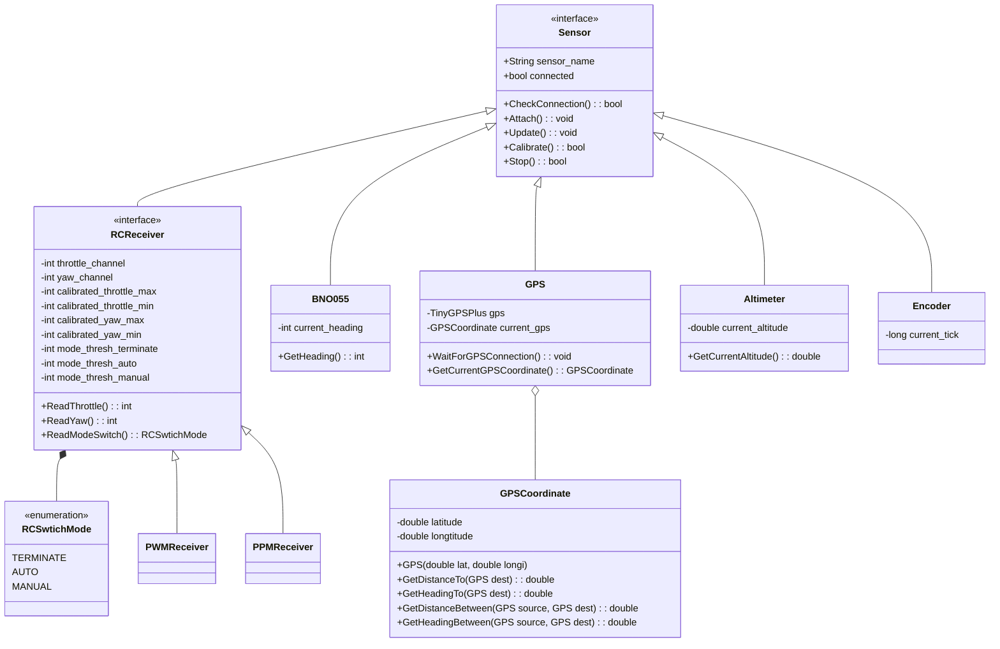
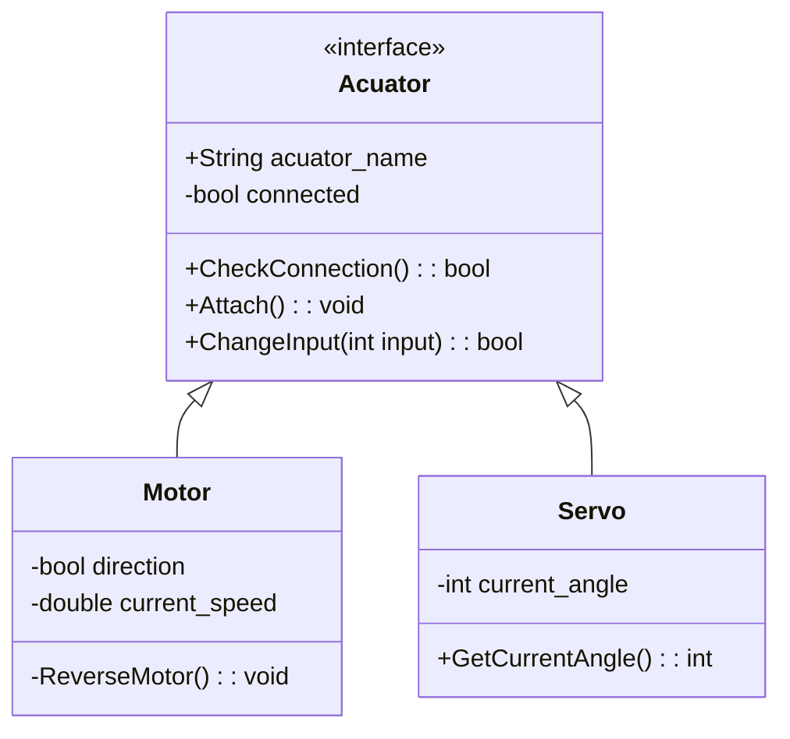
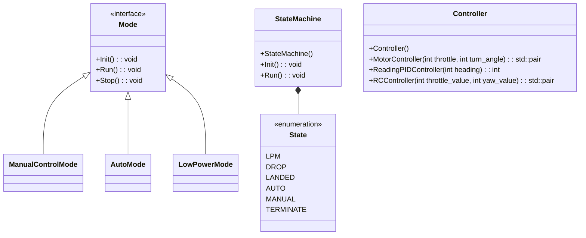

# Design

---

<!-- vscode-markdown-toc -->
* 1. [Software design](#Softwaredesign)
	* 1.1. [Diagram](#Diagram)
		* 1.1.1. [Sensor class](#Sensorclass)
		* 1.1.2. [Acuator class](#Acuatorclass)

<!-- vscode-markdown-toc-config
	numbering=true
	autoSave=true
	/vscode-markdown-toc-config -->
<!-- /vscode-markdown-toc -->

##  1. Software design

###  1.1. Diagram

> We use [mermaid](https://docs.gitlab.com/ee/user/markdown.html#diagrams-and-flowcharts-using-mermaid) as our diagram generator.

####  1.1.1. Sensor class

####  1.1.2. Acuator class

#### Controller class

## Hardware design