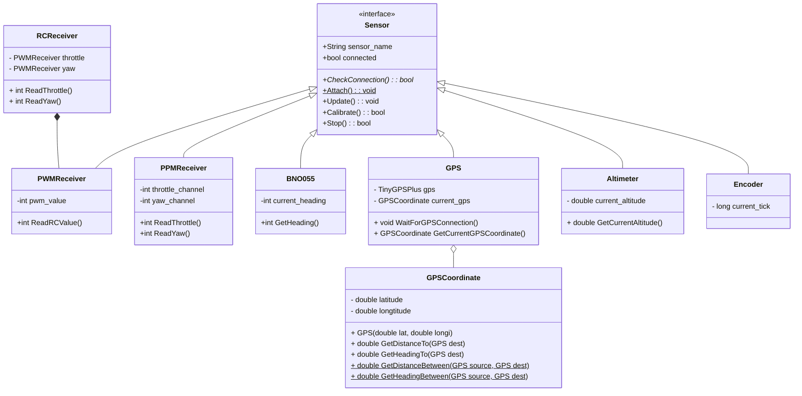

# Design

---

## Software design

### Diagram

> We use [mermaid](https://docs.gitlab.com/ee/user/markdown.html#diagrams-and-flowcharts-using-mermaid) as our diagram generator.

Sensor class


Acuator class


<!-- ```mermaid
classDiagram
class BankAccount{
    +String owner
    +BigDecimal balance
    +deposit(amount) bool
    +withdrawl(amount)
}
class ManualControlMode {

}

class AutoMode{

}

class LowPowerMode {

}


class StateMachine {

}
class Controller {
  - Motor left_motor
  - Motor right_motor
  + std::pair MotorController(int throttle, int turn_angle)
  + int HeadingPIDController(int heading)
  + std::pair RCController()
}

class State {
  <<enumeration>>
  LPM
  DROP
  LANDED
  AUTO
  MANUAL
  TERMINATE
}
``` -->
## Hardware design