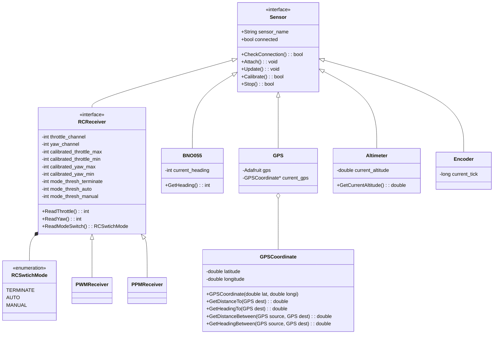
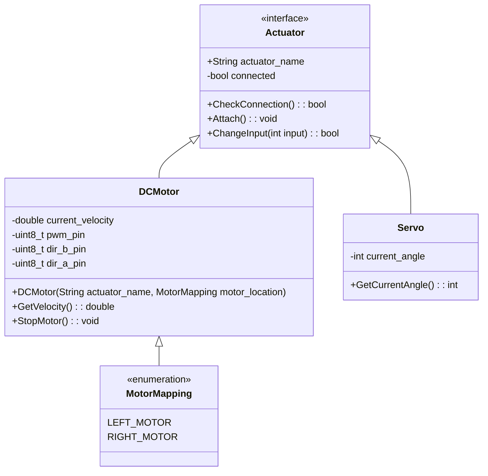
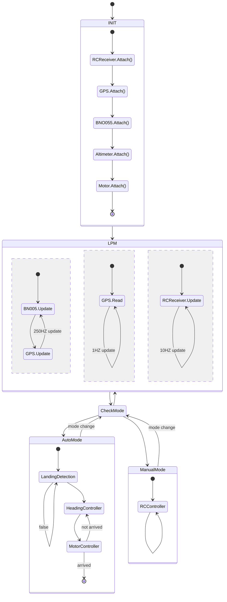

# Design

---

<!-- vscode-markdown-toc -->
* 1. [Rover Software design](#RoverSoftwaredesign)
	* 1.1. [Class UML Diagram](#ClassUMLDiagram)
		* 1.1.1. [Sensor class](#Sensorclass)
		* 1.1.2. [Actuator class](#Actuatorclass)
		* 1.1.3. [Controller class](#Controllerclass)
	* 1.2. [State Diagram](#StateDiagram)
* 2. [Hardware design](#Hardwaredesign)

<!-- vscode-markdown-toc-config
	numbering=true
	autoSave=true

###### 	/vscode-markdown-toc-config -->

<!-- /vscode-markdown-toc -->

##  1. Rover Software design

###  1.1. Class UML Diagram

> We use [mermaid](https://docs.gitlab.com/ee/user/markdown.html#diagrams-and-flowcharts-using-mermaid) as our diagram generator. Read more about how to use it [here](https://mermaid-js.github.io/mermaid/overview/n00b-overview.html)

####  1.1.1. Sensor class

####  1.1.2. Actuator class

####  1.1.3. Controller class

###  1.2. State Diagram

##  2. Hardware design