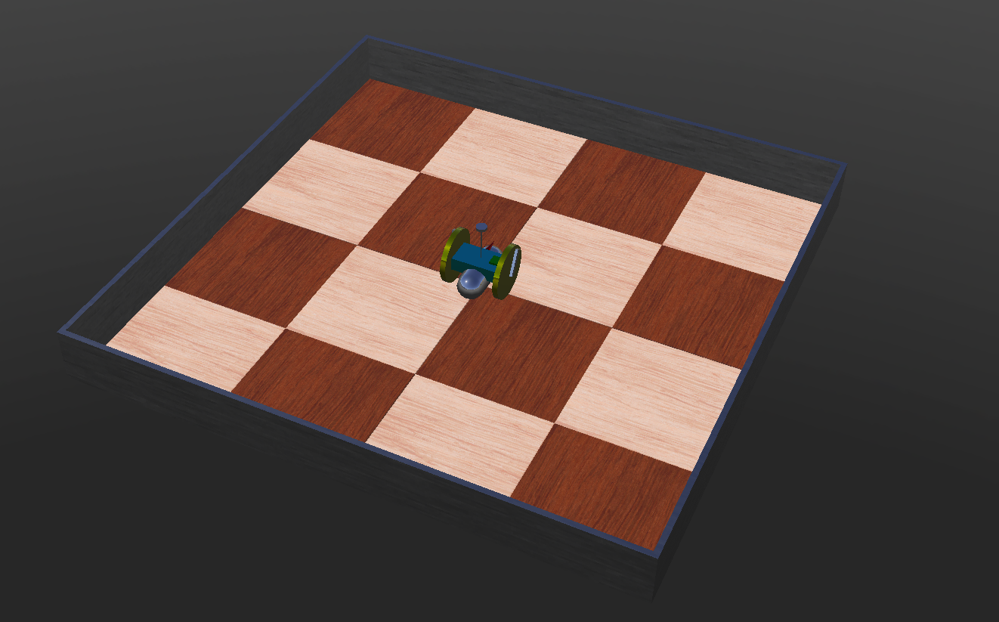

# Wall-E simulation

## 

---

## Installation

Please follow the [offical installation guide](https://www.cyberbotics.com/doc/guide/installation-procedure).

- Supported OS: Window, MacOS, Linux

### Recommend Tutorial

See [official tutorial](https://www.cyberbotics.com/doc/guide/tutorials)

- finish tutorial 1 to 7 (ignore the estimated time)
- complete the tutorial in **c++**

## Run simulation

Click File -> Open World, Navigate to the repository location and open the *empty.wbt*

### Command

mode change with  _

#### Manual mode

| command | function   |
| ------- | ---------- |
| W       | go forward |
| A       | turn left  |
| S       | turn right |
| D       | go back    |
| Q       | full stop  |

#### Auto mode

### Helpful tips

- Make sure the simulation is stopped and reset whenever you plan to make a change. If not, the changes will be removed when reset
- **Always save your work as much as you can!**

| command            | Functionality                                              |
| ------------------ | ---------------------------------------------------------- |
| Double click model | Open controller sensors to visualise the data in real time |
|                    |                                                            |
|                    |                                                            |

